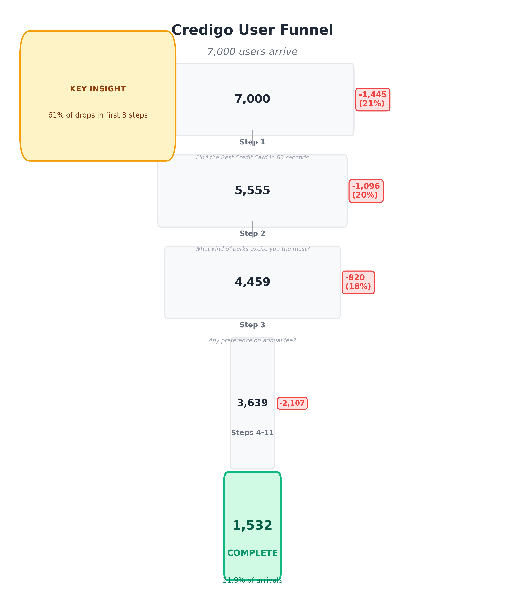

# Credigo: What Your Product Is Actually Doing

---

## DECISION COVER

**Your product converts 22% of users who arrive, and filters out 78% before they complete.** The filtering happens fast—62% of all drop-offs occur in the first three steps. This isn't broken; it's a design choice. Your product prioritizes speed and personalization for users who are already convinced, at the cost of converting users who need more guidance.

---

## THE FUNNEL

**62% of all drop-offs happen in Steps 1-3.** If a user doesn't make it past step 3, they're unlikely to complete.

---

## THE PRIMARY DECISION BOUNDARY

### Step 1: "Find the Best Credit Card In 60 seconds"

**1,445 users drop here (21% of all arrivals)**

**What's happening:**
- Users see the landing page and decide "this isn't for me" before starting
- This isn't a design problem—it's a selection mechanism
- Your product optimizes for users who already know they want a recommendation
- It trades off the ability to convert users who need convincing

**Who drops:**
- Users who aren't sure this is relevant to them
- Users who need to understand value before sharing details
- Users who want to browse or compare, not get a recommendation

**Who continues:**
- Users who are already certain they want a credit card recommendation
- Users ready to share personal details immediately
- Users who trust the "60 seconds" promise

---

## THE CORE TRUTH

**Your product asks for personal details before establishing value.** 

Users who pass step 1 continue through the flow (28% eventually complete). Users who drop at step 1 aren't ready to share spending habits or preferences yet—they need to understand value first.

**What this means:**
- Your product prioritizes personalization over persuasion
- It assumes users want to be matched, not sold
- This works for users who already want a recommendation
- It filters out users who need convincing before they'll share details

**The tradeoff:**
- Better matches for committed users (personalization wins)
- Lower conversion of uncertain users (persuasion loses)

---

## DECISION TRADEOFFS

### Tradeoff 1: Speed vs. Certainty

**Current approach:** Optimized for speed (60-second promise)

**Decision:** Do you optimize for users who are already certain they want a recommendation, or do you slow down to convert the uncertain?

**You can't have both.** This is a product strategy choice, not a fix.

---

### Tradeoff 2: Personalization vs. Persuasion

**Current approach:** Asks for details early (spending, preferences, existing cards)

**Decision:** Do you prioritize personalization (better matches for committed users) or persuasion (convert more uncertain users first, personalize later)?

**Your current approach favors personalization.**

---

### Tradeoff 3: Fast-Fail vs. Gradual Conversion

**Current approach:** 62% of drops happen in steps 1-3 (fast-fail funnel)

**Decision:** Do you keep this (efficient, fast experience) or slow it down (more guidance, higher conversion of uncertain users)?

**Your current approach favors fast-fail efficiency.**

---

## THE UNAVOIDABLE QUESTION

**Your product works exactly as designed for users who are already convinced they want a credit card recommendation.**

**Are you okay with filtering out everyone else, or do you want to slow down to convert the uncertain?**

---

## NOTES

**Source:** Decision Ledger (credigo_ss_decision_ledger.json)  
**Analysis Date:** 2026-01-03  
**Total Sequences Analyzed:** 7,000

This document is derived from immutable decision traces. All numbers are verifiable from the Decision Ledger. This summary can be regenerated but should not be manually edited.
